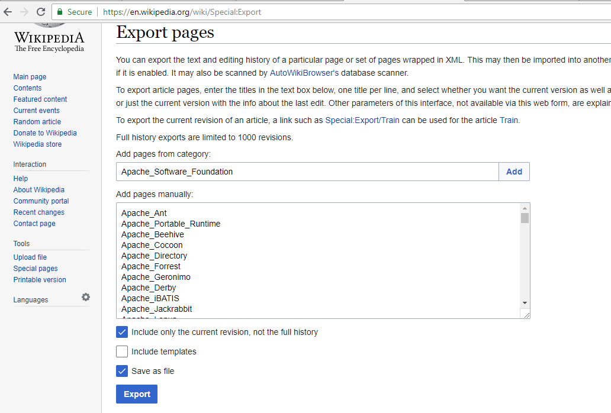
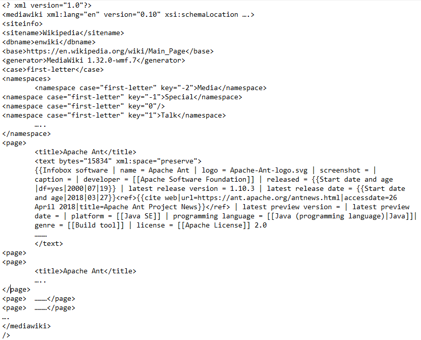
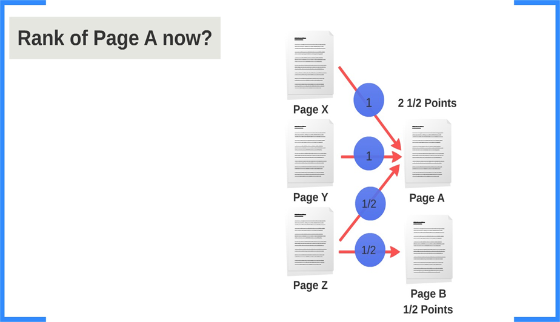
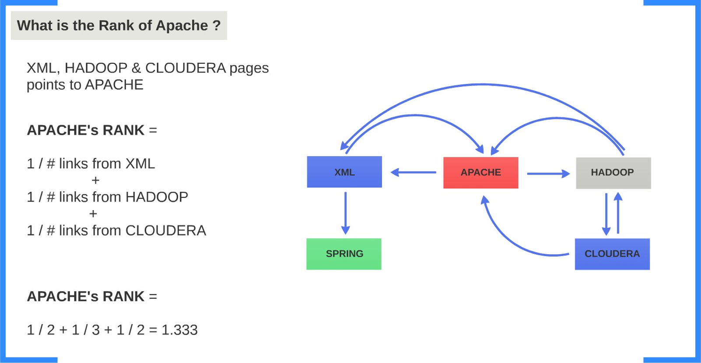
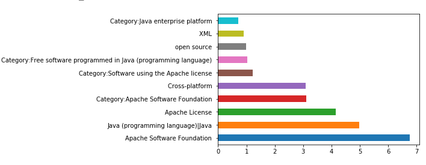

# Wiki-Page-Ranking
This projects parses xml page for wikipedia and ranks pages based on their links between them.

Wikipedia Internal Page Ranking ranks Wikipedia pages based on an algorithm. Algorithm is using the interlinks between the pages and gives points to each page. The page having highest point is ranked first.
Backlinks are incoming links to a webpage. When a webpage links to any other page, it's called a backlink.

Input file for the page ranking is a xml file which can be exported from the this link https://en.wikipedia.org/wiki/Special:Export after adding a page title. You can export the text and editing history of a particular page or set of pages wrapped in XML. The exported file will consists all  the information about the  title page and other page’s information that have backlinks in the main title page or information of the category of the pages.

<h3>Input Format</h3>

Here is the input format of the file. A xml file consists of page information enclosed in page tags(<page>). And Links in each page tag is enclosed in two square brackets ([[Apache Software Foundation]]) as they are represented in bold

On a worldwide all the web pages are interlinked to each other and every page have a link to the other page. All the incoming links to a webpage is called a backlink.
The algorithm used for ranking the webpages is such that, any webpage can only give only one point to other pages. It means that if a webpage has N links, it will give 1/N points to each page and in total it has only one point. Pages having backlinks more than one, then it will add all its points to get the total points for that particular page. At the pages sorted by their points in descending order.

Mapper:
PageRanking task is being done on Hadoop cluster. And this task is completed by the MapReduce job written in Python. Here, Mappers job is first to parse the xml file and foreach pages mapper will parse the links from each page and counts the total number of links from the page.
Foreach page mapper will allocate points to their link pages by using the page ranking formula as shown in fig 2.1. Ranking formula calculates the point for each links from a page. All the links from the same page gets exactly same point.

Points to links for each page = 1 / (total number of links for that page)

Mappers output will be title of the link and the points to that link. Mappers output is passed as same to the reducer and then reducer works on it, to produce the desired result. 

<h4>Reducers:</h4>

Before mappers output is send to the reducer, it is automatically sorted by the Hadoop ecosystem.
Then sorted result is send to the reducer. Reducer adds the points of the pages having same title. After this job reducer sorts the result in descending order and saves the result in the output directory with page and points are separated by comma (,). Reducers output will be the final MapReduce output. MapReduce output is the text file.
Output of mapreduce is visualized further to get attractive result.

<h3>	Result </h3>

MapReduce output is the final result of our Page Ranking project. And it’s a text file that consists of title of the page and the total point of the page separated by comma (,).
Output is visualized using matplotlib library using Jupyter notebook IDE. Visualized output will be a horizontal bar that will show top 10 pages. 

<h3>Conclusion and Future Scopes </h3>

The project has a very vast scope in future. The project can be implemented on intranet in future. Project can be updated in near future as and when requirement for the same arises, as it is very flexible in terms of expansion. It can be modified by algorithm in future.

The proposed work in the Page Rank algorithm includes the implementation to solve the problem of Dangling Page. Dangling pages are pages which do not have any outbound link or the page which does not provide any reference to other pages. These Dangling pages create many issues to calculate efficient page rank of different pages of websites. Even the work is going on to remove circular references, so that proper ranking can be done.
